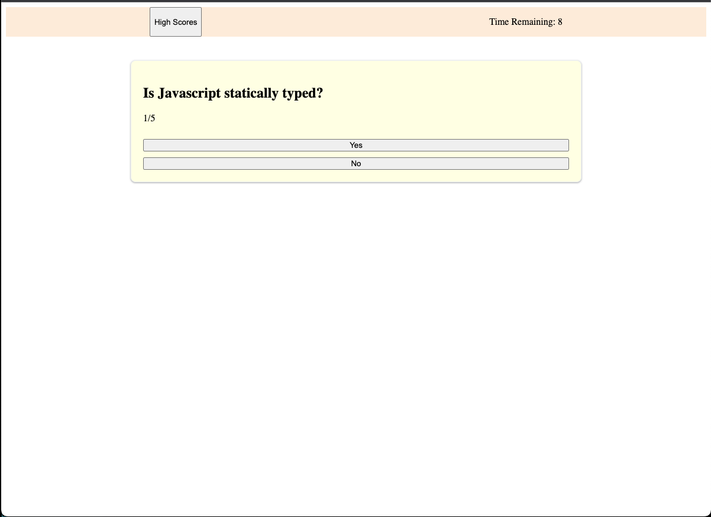
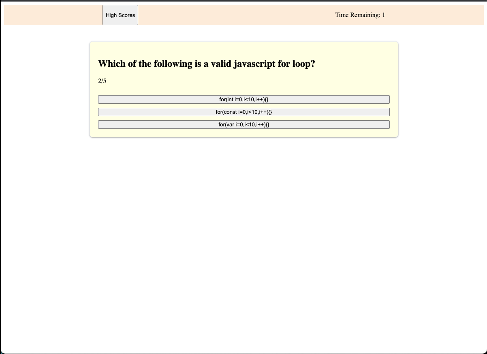
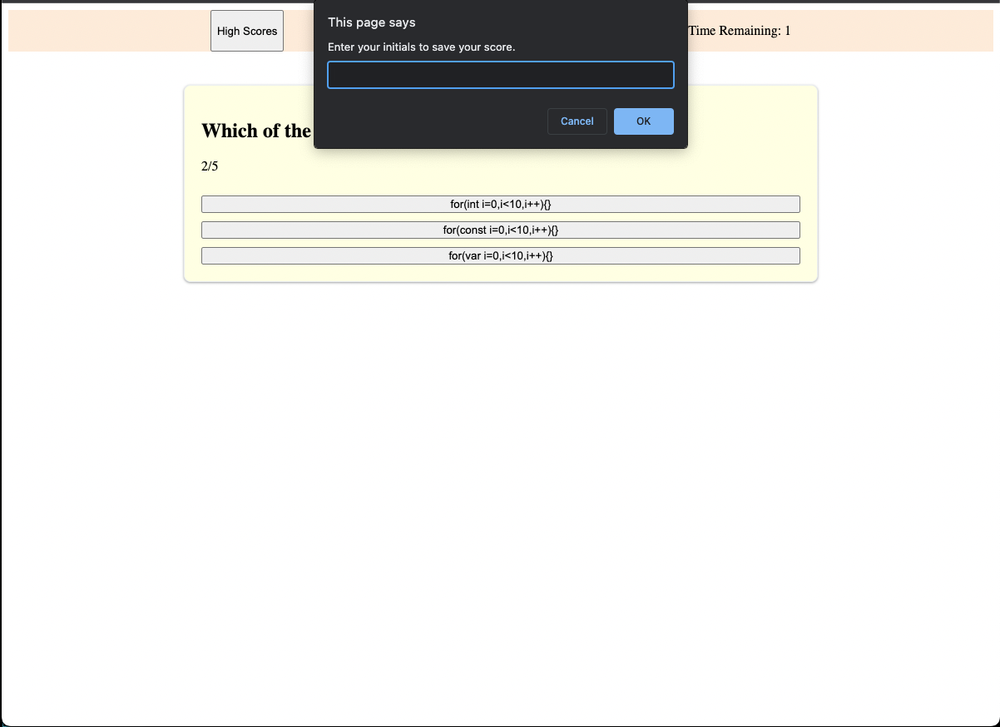
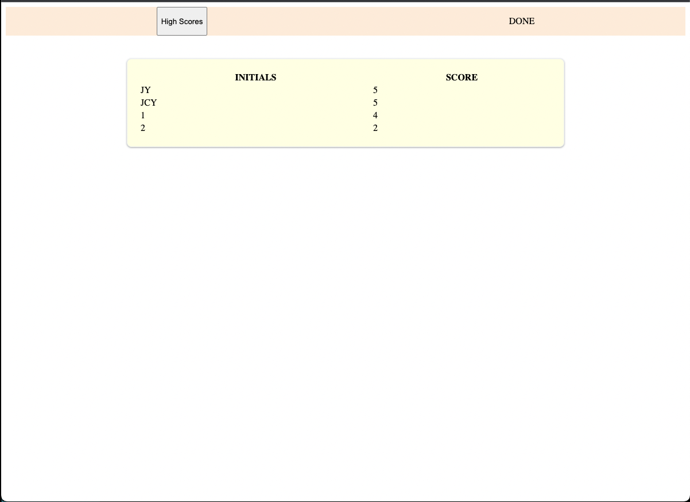

# Challenge4-JavascriptQuizSite
## Description

## Table of Contents
- [Installation](#installation)
- [Usage](#usage)
- [Credits](#credits)
- [License](#license)

## Installation
This project is live on github pages, and the code can be viewed on the repo.

* [github repo here](https://github.com/jamesyoungGHusername/Challenge4-JavascriptQuizSite)

* [github pages deployment here](https://jamesyoungghusername.github.io/Challenge4-JavascriptQuizSite)

## Usage
This is a webpage demoing code for building timed online quizes. There is also code for locally saving highscores.
After creating the class structure, creating the actual quiz took only 7 lines of code.
An object of class quiz contains an array of question objects, which in turn each contain the text of their respective questions and an array of possible (pre-provided) responses.
Allows the person designing the quiz to make questions with more than one correct answer, and allows an arbitrary number of responses to be displayed for any particular question. Could also display other response-type classes.

Though this functionality wasn't implemented, the code was designed to make adding additional quizes in the future easier. The functions that actually run and display a quiz act upon a single quiz object that is provided as a parameter, making it much easier to potentially have multiple quizes running in parallel.

Below are screenshots of intended functionality:

Upon loading the page the quiz display loads from the provided quiz objects.

As the user progresses through the quiz the UI updates, displaying time left, and which question the user is on.

Upon finishing the quiz (or upon the time running out) the page sets the quiz to not active, and prompts the user for their initials to save their score. If the user doesnt enter their initials their score isn't saved.

If the user enters invalid initials (more than 5 characters) the function changes the message displayed to the user and asks again for valid input. This is recursive and will continue until the user provides valid input or decides not to save their score.

Finally, after providing valid input to save their score (or after clicking the High Scores button on the header) the user is shown the high scores table.

## Credits
Comments in code reference sources.

## License
MIT license.
